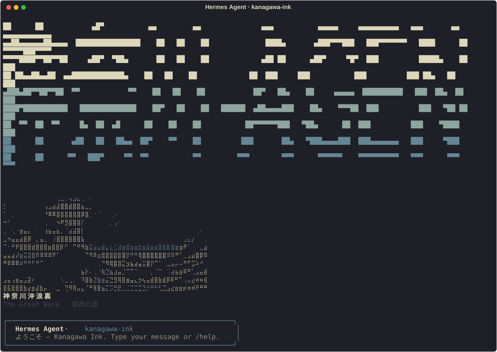
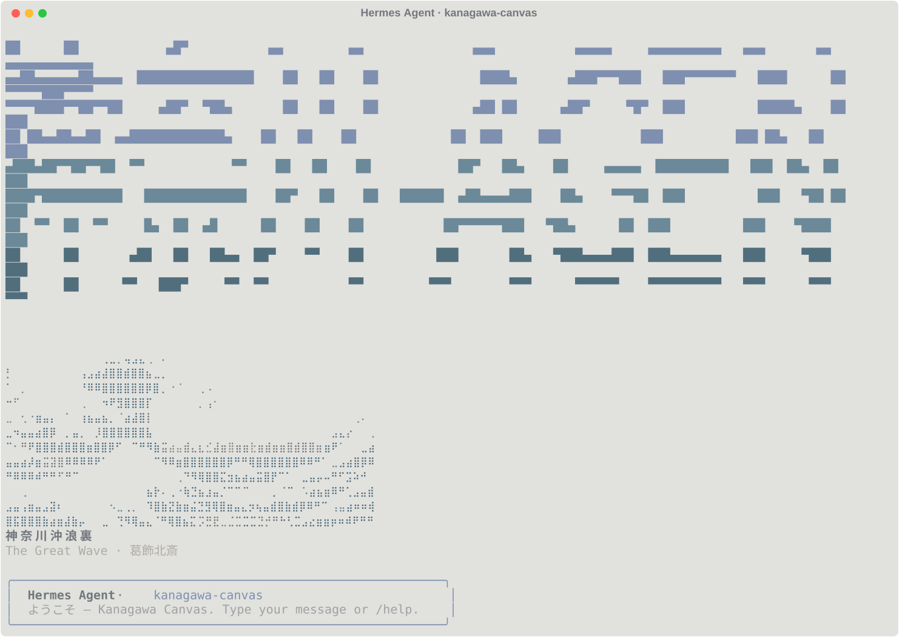

# hermes-kanagawa-skins

Two [Hermes Agent](https://github.com/NousResearch/hermes-agent) CLI skins
inspired by Hokusai's *Great Wave off Kanagawa* and the
[`kanagawa-paper.nvim`](https://github.com/thesimonho/kanagawa-paper.nvim)
colorscheme.

- **`kanagawa-ink`** — dark theme. Sumi-ink background (`#1F1F28`), `dragonYellow`
  primary accent, fuji-white text.
- **`kanagawa-canvas`** — light theme. Canvas off-white background (`#E1E1DE`),
  muted teal accent (`canvasTeal1`), ink-toned text.




Each skin ships with two pieces of custom ASCII art:

1. **`banner_logo`** — block-letter banner reading **神奈川-AGENT** with a
   3-stop vertical color gradient.
2. **`banner_hero`** — palette-quantized braille rendering of Hokusai's wave
   with kanji caption *神奈川沖浪裏* (Under the Wave off Kanagawa).

Both art pieces share the same gradient stops as the wave hero, so the logo
and hero feel unified.

## Install

```bash
git clone https://github.com/mattpetters/hermes-kanagawa-skins.git
cd hermes-kanagawa-skins
./scripts/install.sh        # copies skins to $HERMES_HOME/skins (or ~/.hermes/skins)
```

Then activate:

```text
/skin kanagawa-ink          # in the Hermes CLI
```

Or set as the default in `~/.hermes/config.yaml`:

```yaml
display:
  skin: kanagawa-ink
```

## Pair with Ghostty

These skins were tuned to match the upstream Ghostty themes shipped by
`kanagawa-paper.nvim`. To get the matching terminal palette:

```text
# ~/.config/ghostty/config
theme = dark:kanagawa-paper-ink,light:kanagawa-paper-canvas
```

## What it looks like

Plain text previews live in `assets/previews/*.plain.txt`. Colored Rich-markup
sources (`*.txt`) and rendered SVGs (`assets/screenshots/*.svg`) are alongside.

Regenerate the SVG screenshots:

```bash
python3 scripts/render_screenshots.py
```

## Repository layout

```
.
├── skins/
│   ├── kanagawa-ink.yaml         # dark variant
│   └── kanagawa-canvas.yaml       # light variant
├── scripts/
│   ├── install.sh                # copy skins into $HERMES_HOME/skins
│   ├── regenerate.sh             # full pipeline: hero + logo + inject
│   ├── generate_hero.py          # quantize Hokusai image to braille per palette
│   ├── generate_logo.py          # half-block kanji banner with gradient
│   ├── inject_art.py             # rewrite banner_logo / banner_hero in YAMLs
│   └── render_screenshots.py     # SVG previews of each skin via Rich
└── assets/
    ├── source/
    │   └── hokusai_great_wave.jpg  # Wikimedia public-domain source
    ├── screenshots/                # SVG renders of each active skin
    │   ├── kanagawa-canvas.svg
    │   └── kanagawa-ink.svg
    └── previews/
        ├── canvas_hero.txt
        ├── ink_hero.txt
        ├── banner_A_kanji_en_{canvas,ink}.txt   # 神奈川-AGENT  (active)
        ├── banner_B_full_jp_{canvas,ink}.txt    # 神奈川エージェント
        └── banner_C_hermes_{canvas,ink}.txt     # ヘルメス-神奈川
└── docs/
    └── PALETTE.md                # canvas + ink palette reference
```

## Customizing

The art generators in `scripts/` are intentionally tiny and standalone.

```bash
# Regenerate everything (hero from Hokusai image + kanji logo) and inject:
./scripts/regenerate.sh
```

Common tweaks:

- **Wave detail** — bump `COLS`/`ROWS` at the top of `generate_hero.py`
  (default 50×14). Larger gives more detail at the cost of horizontal space.
- **Wave contrast** — adjust `THRESHOLD` (lower = more dark dots).
- **Logo text** — pick a different variant by changing `INJECT_VARIANT` in
  `inject_art.py` (`A_kanji_en`, `B_full_jp`, or `C_hermes`).
- **Logo gradient** — edit the `PALETTES` dict in `generate_logo.py`. The
  default mirrors the hero's color flow (foam → wave body → deep water).

After tweaking, run `./scripts/regenerate.sh` then `./scripts/install.sh`.

## Skin schema

These skins follow the [Hermes skin schema](https://github.com/NousResearch/hermes-agent/blob/main/website/docs/user-guide/features/skins.md).
Missing keys inherit from the built-in `default` skin. Both files set the
full `colors:` block plus `branding:`, `tool_prefix`, `banner_logo`, and
`banner_hero`. `spinner:` is left empty (`{}`) so the default kawaii spinner
remains, which feels right alongside the warm 葛飾北斎 caption.

## Credit & license

- ASCII art derived from Katsushika Hokusai's *Great Wave off Kanagawa*
  (c. 1831), in the worldwide public domain.
- Color palettes follow the canvas + ink variants of
  [`kanagawa-paper.nvim`](https://github.com/thesimonho/kanagawa-paper.nvim)
  by Simon Ho (MIT).
- Source image: [Wikimedia Commons](https://commons.wikimedia.org/wiki/File:The_Great_Wave_off_Kanagawa.jpg).

This repository is MIT licensed. See [LICENSE](LICENSE).
